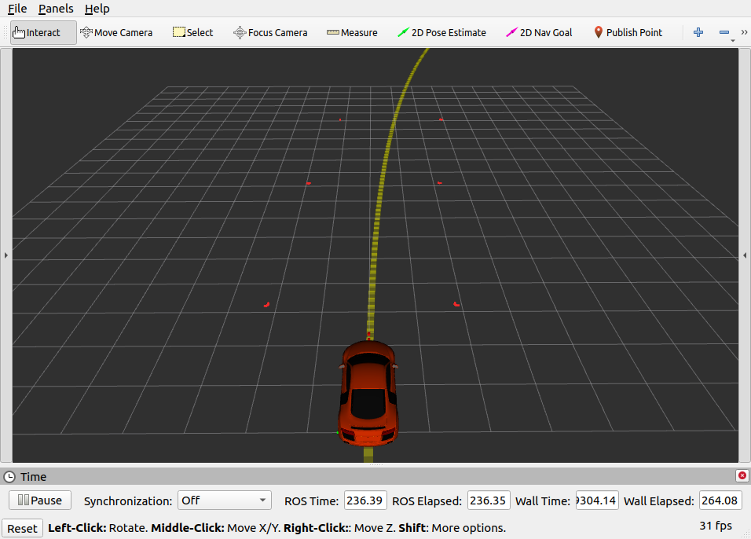

Week 6 Tutorial Questions
=========================

Before we start developing code that uses threading, we will have a look at two implementations of threading that allow us to understand 

Simple_Threading
-----------------------------------------

Threads are created on two functions `incrementNum` and `printNum`.  We pass `num` and `numMutex` to both of these functions, so they can share data and a `mutex` which synchronises access so that both functions are not writing/reading the data simultaneously (which causes corruption of data). 

Attempt following

* Do not secure `num` by a mutex, what occurs?
* Remove the scope `{` and `}` that surrounds locking the mutex, is there a change?
* Can we the lock and unlock  [mutex](https://en.cppreference.com/w/cpp/thread/mutex) , is there a change?
* Can we use a [scoped lock](https://en.cppreference.com/w/cpp/thread/scoped_lock) or [lock guard](https://en.cppreference.com/w/cpp/thread/lock_guard) instead?
* What happens if we do not have the infinite while loop in the threaded functions?  Make incrementNum function finish looping if the number reaches 1000 for instance).

Class_Threading
-----------------------------------------

We have moved the Simple Threading code to a Class `Analysis`. There are few changes, mainly in how the threading starts which is now in the class itself. We moved from a `thread` to a `thread*` and also now need to indicate the `ClassName` associated to the function that is being subject to threading.

Consider:

* Would the main ever stop execution here? 
* Check your CPU usage by using `top` , can you spot your process. What occurs if you reduce the sleep times.

Multi-Thread Data Access (DataBuffer)
-------------------------

We will run two threads in a class on functions `removeValues` and `trimLength` that operate on vector `val_`

Thread 1: removes numbers less than `minVal`and greater than `maxval`
Thread 2: Keeps size of vector to max `trimSize` elements

There are two other functions that are not threaded. `getValues` returns the `val_` vector, while `addValues`  add a vector that has been passed as argument to the function to end of `val_` and  sort the vector via `bubbleSort` private function.

TASKS:
* Start the threads in the constructor, join them in destructor
* Given the vector is ordered, implement code to `removeValues` and make it thread safe (lock the mutex while working on vector and unlock when finished and before the sleep)
* Implement the `trimLength` function that removes elements from vector if it is grown over `trimSize_` length and make it thread safe (lock the mutex while working on vector and unlock when finished and before the sleep)
* Implement the `addValues` function, add to and sort the vector `val_`. Make it thread safe (lock the mutex while working on vector)

**Learning outcomes** (1) starting  multiple threads in object of class (2) we can not guarantee when threads run (3) providing a bit of time between locking/unlocking mutex in the same thread (be it a sleep or some heavy computing) will not `starve` the other thread

Multi-Thread Data Access (Teleop)
-------------------------

We have a very simplified class `Ackerman` which we want to operate continuously. The class is designed to send `UGV` commands of user specified`brake_,steer_,throttle`  continuously. And update them as the user presses key's on the keyboard.

This will allow us to develop a crude `teleoperation` concept. The user presses keys with functions are per below (terminating is `.` key)

```bash
    i o                i - increase throttle
 j  k  l               k - decrease throttle/increase brake
                       j - steer left
                       l - steer right
                       o - brake
                       . -exit
```

The main has the capability to read the keys and the task is to modify the `Ackerman` to drive it around.

TASK

* Create a `pipesPtr_` and start a thread on the `drive` function in constructor of `Ackerman`. 
* Join thread in destructor (and force it to stop)
* In `drive`, lock the mutex, create a `UGV` message and send it via the `pipesPtr_`
* In `setCommand` store the values passed into member variables, don't forget the mutex.

You will need to run the simulator `roslaunch gazebo_tf ugv.launch` to be able to test your teleop.

There is a nice third first person visualiser (driving car around racetrack in first person with cones on side of road). Execute a `git pull` from `pfms-support` folder to get the track and visualiser. then try `roslaunch gazebo_tf ugv_race.launch` 



**Learning outcomes** we show how to implement a thread-safe class, where functions of objects can be called and internally, it guarantees the variables are thread-safe. 
