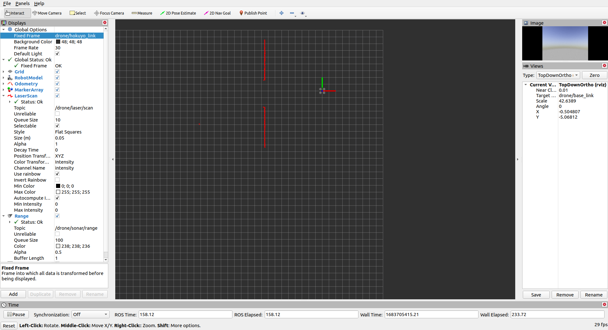

Week 11 Tutorial Questions
=========================

Work through these questions and make sure you understand what is going on in each example. 
If you have any questions about the material, please raise them in the next lab session.

This week's lab questions will make use of pfms-support provided wiith assignment 1/2, do a git pull from the pfms-support folder.

Before you get started, make sure you do the following:

Link the `services_masterclass` folder and `test_masterclass` to your catkin workspace, (ie if your path is <YOURGIT>/tutorial/week11/starter/services_masterclass then execute:

```bash
cd ~/catkin_ws/src
ln -s <YOURGIT>/tutorial/week11/wk11_starter/services_masterclass
```

Compile packages using `catkin_make` 

```bash
cd ~/catkin_ws
catkin_make
```

Focus of exercises is using services and unit tests.

TASK 1 uses  `/wk11_starter/services_masterclass` folder , package name `week11_quad`

TASK 2 uses `/wk11_starer/tests_masterclass` folder, package name `week11_laser`

TASK 1: Using ROS Service
----------------------------

Our Quadcopter will receive a goal via `/drone/goal` of the type `geometry_msgs/Point`.  A incoming service call can be made on `/reach_goal`  of type `std_msgs/SetBool` which runs function `Quadcopter::request`. To view the service message type `rossrv info std_srvs/SetBool`. We aim to track the status of the quadcopter via `quadcopter::PlatformStatus status_` , status is defined in `quadcopter.h`.

We can run in two separate terminals

```bash
roslaunch gazebo_tf uav_a3.launch
rosrun week11_quad week11_quad_sample
```

To send a goal type in `rostopic pub /drone/goal` and then hit TAB a few times, it will allow to send a goal where you can edit the goal itself

```bash
rostopic pub /drone/goal geometry_msgs/Point "x: 8.0
y: 8.0
z: 2.0" 
```

**Modify the code so that**

1. We can modify the status of Quadcopter via the service and the data field in request portion 
   *  if data is true
     * will TAKEOFF if the platform is GROUNDED and there are no goals
     * will TAKEOFF and then perform execution of the goal (RUNNING) if there is a goal set that is not yet reached
   * if data is false
     * will perform LANDING and then go to GROUNDED irrespective if there is a goal

2. We can obtain the current status of the Quadcopter via the service and the success and message part of the response portion

* The success field
  * returns true if there is a goal set that is not yet reached
* The message field 
  * shall have a string corresponding to current status (for instance IDLE status responds back with `IDLE` string value)

**HINTS**

* There is a thread of execution `reachGoal`. Keep this the loop that runs through at 10Hz  (play around with the rate needed)
* Check your select/case or if/then statements to handle status 
* How to we share data between the service call and thread of execution?
* How if the odometry accesses and why is it private in controller.h? 
* We have had to place the PlatformStatus value under namespace quadcopter
* Do we have to assume quadcopter is GROUNDED at startup ... or can we check the odometry?


TASK2: GoogleTest in ROS (Unit Testing)
----------------------------

The week11_laser package defines some unit tests and compiles a test executable called `week11_laser-test`. You can find the unit tests itself as in [utest.cpp](./wk11_starter/tests_masterclass/test/utest.cpp)

Unit tests are performed on libraries, code that is well defined and is often isolated from the ROS framework of topics / services.  **You should NOT have code with callbacks being tested**. You can opt to have different constructors that allow various forms of integration. In this case we have a [LaserProcessing](./wk11_starter/tests_masterclass/src/laser_processing.h) class that is compiled into a library and thereafter used within the ROS framework.

The test cases are done in isolation from topics/subscribers and we can collect data independently and test our code and will use rviz for this. You can change between local or global views in rviz with a single step, by selecting the Fixed frame data is represented.  If you `roslaunch gazebo_tf uav_a3.launch` you can change **FixedFrame** to be `drone/hokuyo_link` (which is the hokuyo laser frame - local frame of quadcopter). I would also advise to change **View Type**  to `TopDownOrtho` (you can find Displays and Views under Panels). If you want to revert to the initial view change **FixedFrame** to `world` and View Type to `ThirdPersonFollower` with `drone/base_link`  as target. As long as you not save the rviz config it will divert back to the one supplied by us when you close and re-open it.



You can also save the raw data into a bag that you can use for testing, below will record 10 messages of each topic.

```bash
rosbag record /tf /tf_static /uav_odom /drone/laser/scan -l 5
```

It is the nature of unit tests, that the answer is known for the test, checking the function for a variety of situations with known answers.  You can use the **PublishPoint** tool and click on the closest reading (you will see a little icon next to cursor indicating you can click on something). You can see in `rostopic echo /clicked_point ` the point your clicking on. For instance with the bag supplied it reports:

```bash
rostopic echo /clicked_point 
WARNING: no messages received and simulated time is active.
Is /clock being published?
header: 
  seq: 0
  stamp: 
    secs: 46
    nsecs: 930000000
  frame_id: "drone/hokuyo_link"
point: 
  x: -4.260223865509033
  y: 0.7899687886238098
  z: 0.0030517578125
```

Therefore our unit test expects

```c++
    EXPECT_NEAR(pt.x,-4.26,0.1);
    EXPECT_NEAR(pt.y,0.79,0.1);   
```

To make all tests `catkin_make tests` , it's plural **tests**

You can run tests 
```bash
rosrun week11_laser week11_lasertest
```

**Your tasks**

* Move the drone about using drone_keyboard `rosrun sjtu_drone drone_keyboard` and go to a person inside building.
* Collect data into a bag and use the **PublishPoint** tool to get the "ground truth" of the person location in laser coordinates
* Create a new test that opens your bag and has tests of the position of closest thins (being person) in laser coordinates using your "ground truth"
* Create a local to global piece of code (you can decide if it is in LaserProcessing or separate file), use the **PublishPoint** tool to get the "ground truth" of the person location in world coordinates.

**Further work**

* Create a unit test for the Ackerman. What needs to change (hint: obviously launch file, but what needs to change in recording bag, rviz and inside the test itself).


[services_masterclass]: starter/services_masterclass
[utest.cpp]: starter/services_masterclass/test/utest.cpp
[quiz5a]: ../../quizzes/quiz5/a
[pfms_support]: ../../skeleton/pfms_support
